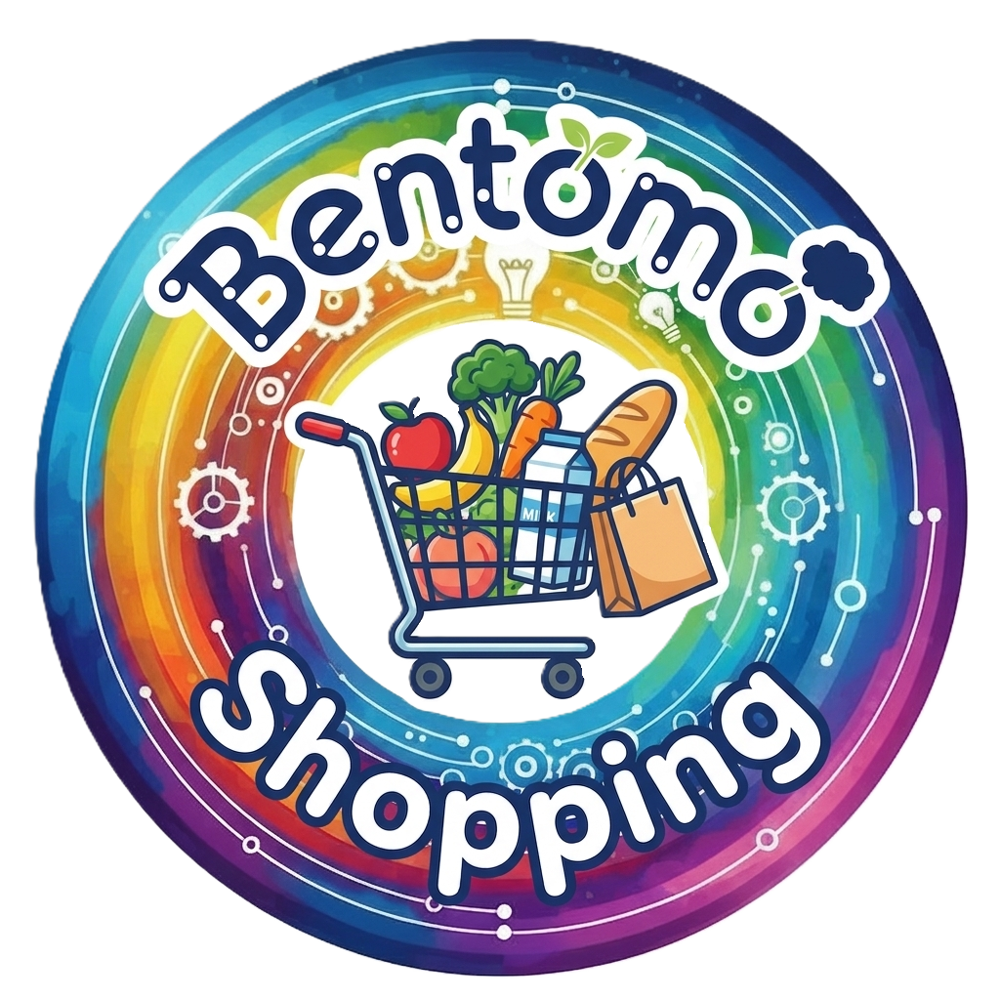

<p align="center">
  
</p>

<h1 align="center">Bentomo Shopping</h1>

<p align="center">
  <strong>Free shopping list for the whole family</strong><br>
  A fast, simple, and collaborative app for managing your grocery lists
</p>

<p align="center">
  <a href="https://render.com/deploy?repo=https://github.com/Bolex80/Shopping"></a>
  &nbsp;
  <a href="https://cloud.digitalocean.com/apps/new?repo=https://github.com/Bolex80/Shopping/tree/main"></a>
</p>

---

## Screenshots

<p align="center">
  
</p>

---

## About Bentomo Shopping

**Bentomo Shopping** is a lightweight web application for managing shopping lists, designed for families and households. It enables real-time synchronization across multiple devices so that everyone — from a partner to the kids — knows what to buy and what is already in the cart.

The app runs in any modern browser on mobile and desktop. It requires just one password to log in — no complicated registration or accounts needed.

This project is a community fork of **Koffan** (by PanSalut), rebranded and extended under the Bentomo family of tools.

## Why build this?

We needed an app that would let the whole family create a shopping list together and get groceries done quickly. After testing various solutions, none were simple and fast enough for our workflow — so we forked and improved one that was close.

The app is written in **Go** and uses just **~2.5 MB RAM** at runtime, making it ideal for self-hosting alongside other services.

## Features

- **Ultra-lightweight** — ~16 MB on disk, ~2.5 MB RAM
- **Multiple lists** — Create separate lists for different stores or occasions, each with a custom icon
- **PWA** — Install on your phone home screen like a native app
- **Offline mode** — Add, edit, check, and uncheck items without internet (auto-sync when reconnected)
- **Real-time sync** — WebSocket-based live updates across all connected devices
- **Auto-completion** — Fuzzy search from your history, remembers sections
- **Organized sections** — Group products into categories (e.g., Produce, Dairy, Cleaning)
- **Quantity stepper** — Adjust amounts quickly with +/- buttons
- **Mark as purchased** — Check off items as you shop
- **Mark as uncertain** — Flag items you cannot find in the store
- **Responsive UI** — Mobile-first design, works great on tablets and desktops
- **Dark mode** — Respects system preferences with manual override
- **Multi-language** — English, Spanish, Polish, German, French, Portuguese, Ukrainian, Norwegian, Lithuanian, Greek, Slovak, Swedish, Russian
- **Simple login** — One shared password per instance
- **Rate limiting** — Brute-force protection on login attempts
- **REST API** — Access programmatically for integrations and migrations
- **Import / Export** — Move your data in and out via JSON or CSV

## Tech Stack

- **Backend:** Go 1.21 + Fiber
- **Frontend:** HTMX + Alpine.js + Tailwind CSS
- **Database:** SQLite

## Local Setup (without Docker)

You can run Bentomo Shopping directly on your machine using Go. This works on macOS, Linux, and Windows.

### 1. Install Go

**macOS (Homebrew):**
```bash
brew install go
```

**Linux (Debian/Ubuntu):**
```bash
sudo apt install golang-go
```

**Windows:**
Download from [go.dev/dl](https://go.dev/dl/)

### 2. Clone and Run

```bash
git clone https://github.com/Bolex80/Shopping.git
cd Shopping
go run main.go
```

App available at http://localhost:3000

Default password: `shopping123`

To set a custom password:
```bash
APP_PASSWORD=yourpassword go run main.go
```

## Docker

### Quick Start (recommended)

```bash
docker run -d -p 3000:80 -e APP_PASSWORD=yourpassword -v shopping-data:/data ghcr.io/bolex80/shopping:latest
```

App available at http://localhost:3000

### Build from source

```bash
git clone https://github.com/Bolex80/Shopping.git
cd Shopping
docker build -t bentomo-shopping .
docker run -d -p 80:80 -e APP_PASSWORD=your-password -v shopping-data:/data bentomo-shopping
```

## Environment Variables

| Variable | Default | Description |
|----------|---------|-------------|
| `APP_ENV` | `development` | Set to `production` for secure cookies |
| `APP_PASSWORD` | `shopping123` | Login password |
| `DISABLE_AUTH` | `false` | Set to `true` to disable authentication (for reverse proxy setups) |
| `PORT` | `80` (Docker) / `3000` (local) | Server port |
| `DB_PATH` | `./shopping.db` | Database file path |
| `DEFAULT_LANG` | `en` | Default UI language (en, es, pl, de, fr, pt, uk, no, lt, el, sk, sv, ru) |
| `LOGIN_MAX_ATTEMPTS` | `5` | Max login attempts before lockout |
| `LOGIN_WINDOW_MINUTES` | `15` | Time window for counting attempts |
| `LOGIN_LOCKOUT_MINUTES` | `30` | Lockout duration after lockout |
| `API_TOKEN` | *(disabled)* | Enable REST API with this token |

## Deploy to Your Server

### Docker Compose

```bash
git clone https://github.com/Bolex80/Shopping.git
cd Shopping
docker compose up -d
```

App available at http://localhost:80

### Coolify

1. Add new resource → **Docker Compose** → Select your Git repository or use `https://github.com/Bolex80/Shopping`
2. Set domain in **Domains** section
3. Enable **Connect to Predefined Network** in Advanced settings
4. Add environment variable `APP_PASSWORD` with your password
5. Deploy

### Persistent Storage

Data is stored in `/data/shopping.db`. Mount a volume to that path to ensure your data persists across container restarts.

## Contributing

This is a personal fork maintained for family use. Feel free to:
- Fork and adapt for your own household
- Open issues for bugs or suggestions
- Submit pull requests for improvements

## License

MIT License with [Commons Clause](https://commonsclause.com/).

You are free to use, modify, and share this software for any purpose, including commercial use within your organization. However, you may not sell the software or offer it as a paid service.

---

<p align="center">
  <i>Built with care for families who shop together</i>
</p>
